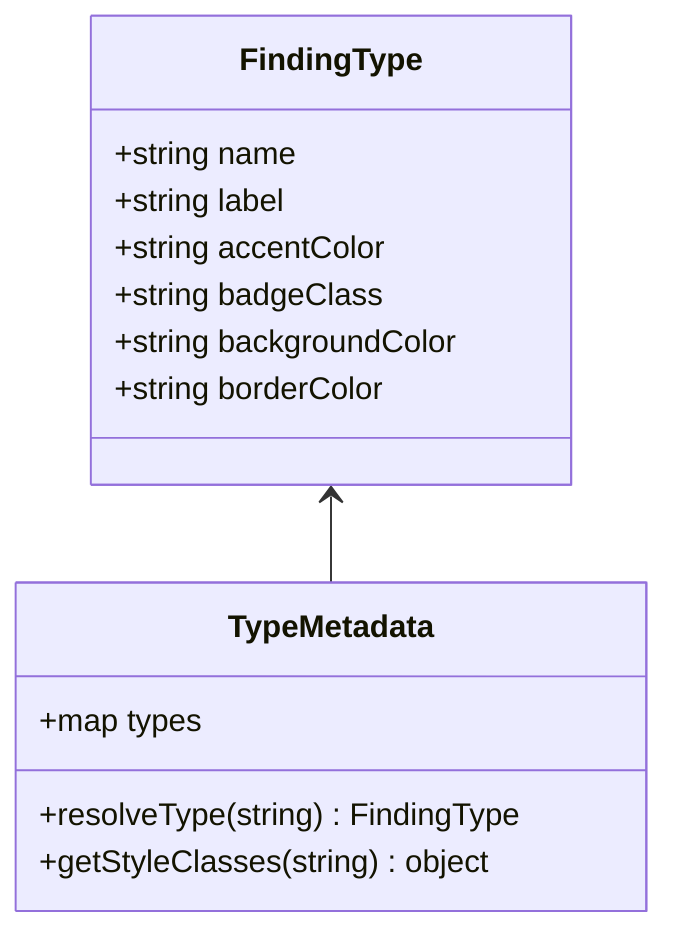
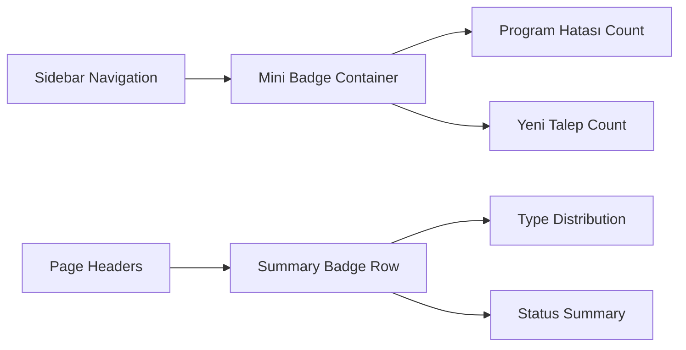
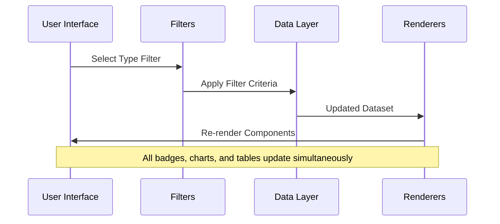

# POS Tracker - Segmented Finding & Request Management Completion Design

## Overview

This design document outlines the completion of remaining tasks (6-10) for implementing segmented finding and request management in the POS Tracker application. The system manages program errors ("Program Hatası") and new requests ("Yeni Talep") with distinct visual styling and improved user experience.

## Technology Stack & Dependencies

- **Backend**: Node.js with Express.js
- **Frontend**: Vanilla JavaScript with Tailwind CSS
- **Database**: SQLite
- **UI Components**: Custom modals, tables, and form components
- **Styling**: Tailwind CSS utility classes with custom CSS extensions

## Architecture

### Current Implementation Status
- ✅ Tasks 1-5: Dashboard data model extension, summary cards, chart revisions, dynamic headers, and type filter toggles
- ⏳ Tasks 6-10: Color-coded type badges, mini badges placement, modal enhancements, styling definitions, and comprehensive testing

### Component Architecture

```mermaid
graph TB
    A[Main Application] --> B[UI Components]
    A --> C[Data Layer]
    A --> D[Event Handlers]
    
    B --> E[Tables]
    B --> F[Modals]
    B --> G[Pages]
    B --> H[Renderers]
    
    E --> I[Type Badges]
    E --> J[Action Buttons]
    
    F --> K[Detail Modals]
    F --> L[Edit Modals]
    
    G --> M[Dashboard]
    G --> N[Findings List]
    G --> O[Management Panel]
</graph>
```

### Type System Design



## Task Implementation Details

### Task 6: Color-Coded Type Badges in Finding Table

**Implementation Location**: `public/ui/tables.js` - `getBulgularTableHTML()` function

**Current State**: Generic badge styling exists but not type-specific colors

**Required Changes**:
- Enhance `getBadgeClass()` function to handle finding types specifically
- Add distinct color schemes for "Program Hatası" and "Yeni Talep"
- Implement fallback styling for unknown types

**Color Scheme**:
- **Program Hatası**: Red color palette (`bg-red-100 text-red-800`)
- **Yeni Talep**: Emerald/Green color palette (`bg-emerald-100 text-emerald-800`)

### Task 7: Sidebar and Page Header Mini Badges

**Implementation Location**: 
- `public/index.html` - Sidebar enhancement
- `public/ui/pages.js` - Page header integration

**Requirements**:
- Real-time count display for each finding type
- Strategic placement in sidebar or page headers
- Live data synchronization with dashboard statistics
- Compact visual design matching existing UI patterns

**Badge Placement Strategy**:


### Task 8: Enhanced Type Information in Detail Modals

**Implementation Location**: `public/ui/modals.js`

**Target Modals**:
- `getBulguViewModalHTML()` - View finding details
- `getBulguModalHTML()` - Edit finding form

**Enhancements**:
- Prominent type display with color coding
- Type-specific styling in modal headers
- Enhanced visual hierarchy for type information
- Consistent styling across all modal interactions

### Task 9: Color Palette and Style Definitions

**Implementation Location**: `public/index.html` - `<style>` section

**Style System**:
```css
/* Type-specific color schemes */
.type-program-hatasi {
  --type-bg: #fef2f2;
  --type-border: #fecaca;
  --type-text: #991b1b;
  --type-accent: #dc2626;
}

.type-yeni-talep {
  --type-bg: #ecfdf5;
  --type-border: #a7f3d0;
  --type-text: #065f46;
  --type-accent: #059669;
}
```

**Component Styles**:
- Badge variations for different contexts
- Mini badge sizing and positioning
- Modal header enhancements
- Interactive state styling

### Task 10: Comprehensive Testing Scenarios

**Test Coverage Areas**:

1. **Type Filter Functionality**
   - Toggle between "Tümü", "Program Hatası", "Yeni Talep"
   - Data filtering accuracy
   - UI state synchronization

2. **Chart and Graph Updates**
   - Vendor chart dual dataset rendering
   - Status distribution with type segments
   - Real-time data refresh

3. **Modal Type Display**
   - Color coding consistency
   - Type information prominence
   - Cross-modal navigation

4. **Badge and Counter Updates**
   - Live count synchronization
   - Visual state changes
   - Performance under data updates

## Data Flow Between UI Components



## State Management Strategy

### Filter State Structure
```javascript
const bulguFilters = {
    tip: 'all', // 'all' | 'Program Hatası' | 'Yeni Talep'
    searchTerm: '',
    vendorId: 'all',
    status: 'all'
};
```

### Type Metadata Management
```javascript
const typeMeta = {
    'Program Hatası': {
        label: 'Program Hatası',
        accent: 'text-red-600',
        badge: 'bg-red-100 text-red-700',
        bg: 'bg-red-50',
        border: 'border-red-200'
    },
    'Yeni Talep': {
        label: 'Yeni Talep',
        accent: 'text-emerald-600',
        badge: 'bg-emerald-100 text-emerald-700',
        bg: 'bg-emerald-50',
        border: 'border-emerald-200'
    }
};
```

## UI Enhancement Specifications

### Badge Sizing Guidelines
- **Table Badges**: Standard size (px-2 py-1 text-xs)
- **Mini Badges**: Compact size (px-1.5 py-0.5 text-xs)
- **Header Badges**: Medium size (px-3 py-1 text-sm)

### Color Accessibility
- Maintain WCAG AA contrast ratios
- Provide alternative indicators for color-blind users
- Consistent color mapping across all components

### Responsive Design Considerations
- Badge text truncation on mobile devices
- Adaptive spacing in sidebar
- Flexible modal layouts

## Testing Strategy

### Unit Testing Scenarios
1. **Type Classification**
   - Correct badge class resolution
   - Fallback handling for unknown types
   - Color scheme consistency

2. **Filter Integration**
   - Toggle button state management
   - Data synchronization accuracy
   - Performance with large datasets

3. **UI Component Updates**
   - Badge count accuracy
   - Modal type display
   - Chart data visualization

### Integration Testing
1. **End-to-End Type Workflows**
   - Create new finding → View in list → Edit details
   - Filter by type → Export results → Import validation
   - Dashboard view → Drill-down navigation

2. **Cross-Browser Compatibility**
   - Color rendering consistency
   - Interactive element behavior
   - Performance optimization

### Performance Testing
- Badge rendering performance with 1000+ records
- Filter response time optimization
- Memory usage monitoring during type switches

## Implementation Priority

### Phase 1: Core Visual Enhancements (Tasks 6-7)
1. Implement color-coded badges in table
2. Add mini badges to sidebar/headers
3. Update CSS style definitions

### Phase 2: Modal and Detail Improvements (Task 8-9)
1. Enhance modal type displays
2. Complete color palette implementation
3. Refine interactive states

### Phase 3: Testing and Validation (Task 10)
1. Execute comprehensive test scenarios
2. Performance optimization
3. Cross-browser validation
4. User acceptance testing

## Risk Assessment

### Technical Risks
- **CSS Conflicts**: New styles may conflict with existing Tailwind classes
- **Performance Impact**: Additional DOM manipulation for badges
- **Browser Compatibility**: Custom CSS variable support

### Mitigation Strategies
- Progressive enhancement approach
- Fallback styling for older browsers
- Performance monitoring during implementation

## Success Metrics

### Functional Requirements
- ✅ All type filters work correctly
- ✅ Badge colors match specifications
- ✅ Real-time count updates function
- ✅ Modal enhancements display properly

### User Experience Goals
- Improved visual distinction between finding types
- Faster navigation through type-specific filtering
- Enhanced information hierarchy in modals
- Consistent design language across application